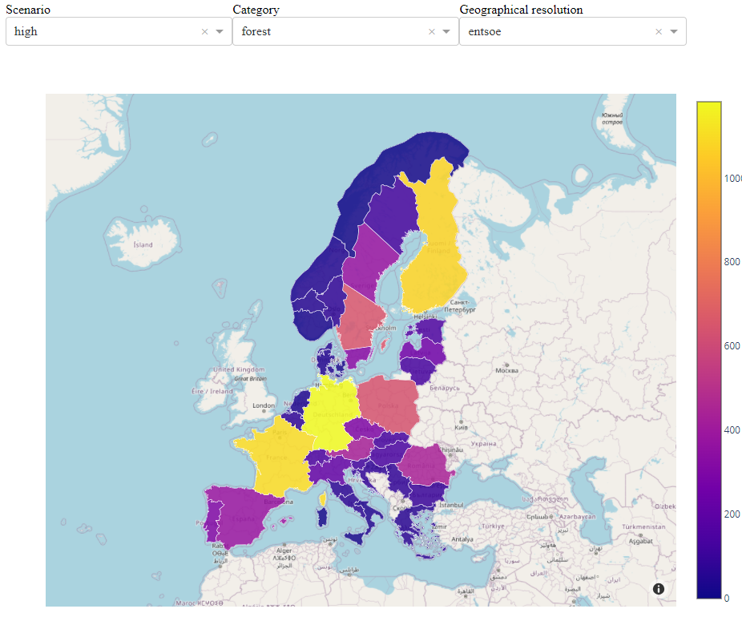

# Biomass Dataset

VTT hosts the original source of this dataset. The current dataset is available on Zenodo.

The DB contains data regarding 3 types of biomass, for a wide range of subcategories and up to NUTS3.

## Authors

Jean-Nicolas Louis and Tomi J. Lindroos

VTT Technical Research Centre of Finland

## Sources

The database is built over three main sources

* S2Biom database from where most of the numbers come from
* ENSPRESO database that we use for few energy sources that are not part of s2biom
* National data for Switzerland

Data processing is done with Julia code that has short documentation and additional databasePipeline.pdf


## Building the biomass database

The database is built using Julia.

The code was compiled and tested with Julia 1.9.4 and 1.10.4.


#### Activate the Julia environment

You first need to activate the environment where the project is installed

`julia> cd("<The path to the project>")`

Once you are within the project, you must activate it to make it effective. First, activate the packages by pressing is `]` in the julia REPL

then to activate the current project, just add `.` at the end of the activate statement

```julia
(@v1.10) pkg> activate .
```

press backspace to exit Pkg prompt.


#### Installing required packages

When running the file for the first time, ensure you have the following packages installed in your local environment.

CSV, DataFrames,XLSX, SQLite, DataStructures, Logging, LoggingExtras, Dates, Shapefile, ZipFile, Plots

An easy way to add all packages is to call the packages.jl file that will install all the required packages in the environment

```julia
julia> include("packages.jl")
```

When testing, there was 239 dependencies in total and it takes up to 4 min to compile the file depending how many you already have installed. 

Packages can be installed separately with  `import Pkg; Pkg.add("<package to install>")` for each missing package.

Note: PlotlyJS might fail to compile as it seems to have its difficulties. You can try to reinstall it separately, and/or remove the package first and then reinstall.

Note: Kaleido package might fail to respond. This is a known issue and these functions were updated to work also without Kaleido.

#### Running the database collection

!!! Warning

    The Enspreso database has glitches that are taken care of in the script, however, for readibility in the script, one has to be changed manually. Opening the ENSPRESO_BIOMASS.xslx file, navigate to the ... worksheet and change the header from NUST2 --> NUTS2. Save the file and close.


The first thing you can do is to run the function: 

```julia
julia> include("collect_biomass_data.jl")
julia> collect_biomass_data(update=true)
```

The runtime is around 2 minutes and the code will print the start and end of the generated database when finished. The version in this deliverable prints a table that has 194961 rows.

The function will generate:

- Download the original excel from all 3 sources, if the excel files are already in the folder structure, then it will skip the download
  - ENSPRESO_BIOMASS.xlsx, ENSPRESO_SOLAR_PV_CSP.XLSX, ENSPRESO_WIND_ONSHORE_OFFSHORE.XLSX
  - biomasspotentials_cantonal-level.xlsx, biomasspotentials_detailed_national-level.xlsx, biomasssupplycost.docx, domestic_biomass_potential_theoretic_sustainable_absolute-per-municipality.xlsx
  - data_<country alpha code>.xlsx (37 excel files)

The function will generate:

* db_biomass_ener_mopo.csv - the result database in CSV format with energy contents of biomass
* db_biomass_mass_mopo.csv - the result database in CSV format with the weight of biomass
* biomass.db sqlite database  - the result database in SQLite format
* enspresso_costs.db - SQLite database that is needed to retrieve cost data


The function includes an optional argument for updating the Enspresso database and it can be left out. In this case, you would run

```julia
julia> collect_biomass_data()
```

This provides shorter runtimes when trying to update the code.


## Displaying the database on a map, pfd/html/dash

Activate the Julia environment as above. 


#### pdf

There is a specific function to draw maps from the dataset as pdfs. The layout is not too polished, but this allows an easy conversion to e.g. illustrator, Inkscape.

```julia
julia> include("mapping_html.jl")
julia> mapping_html()
```

This reads either the precompiled database part or an updated database from the same folder, saves the generated map as .pdf, and should open it with your default pdf viewer.

The fuctions has following arguments:

* res = nuts0, nuts1, nuts2, nuts3. Default = nuts3
* scenario = high, medium, low. Default = high
* maincat = agriculture, forest, organic waste. Default = agriculture

Used e.g. 

```julia
julia> include("mapping_pdf.jl")
julia> mapping_pdf(res="nuts0", scenario="medium", maincat="forest")
```

#### html

```julia
julia> include("mapping_pdf.jl")
julia> mapping_pdf()
```

This saves the generated map as .html file and should open it in your default browser. It has the same arguments as above.

#### dash

Alternatively, one can display the maps in a dash (works only with Julia 1.10.6, does not work with 1.11.1, HTTP server incompatibility between packages)

```julia
julia> include("biomass_dash.jl")
```

and open in your browser the local port http://127.0.0.1:8050 (check the Julia prompt if it is listening to a different port)



All data are saved in a temp folder. As GeoDataFrames as a driver constraints of not being able to overwrite existing .geojson file, files are created for each query, therefore, you may delete the entire folder once you are closing the dash.


## Aggregating data for ENTSO-E bidding zones

Data aggregation for ENTSO-E bidding zones can be done with nuts_bidding_zone.csv that has a mapping of (nuts3, nuts2, bidding zone).

Aggregated data can be plotted on shape file in entsoe_shp folder.

Alternatively, the file get_data.jl has automated function for this 

```
query_db2(;type_id=nothing, nuts=nothing, maincat=nothing, entsoe_nuts=nothing, scenario=nothing, year=nothing)
````


## Setting constraints on maximum allowed national amounts

It is very important to understand that this database contains technical potential instead of allowed amounts.

The actual allowed amount depends on many other criteria such as land use sector emissions and sinks, biodiversity, etc. When using this database, the user should compare the technical potentials to actual historical use.

comparison_biofuel_amounts.xlsx shows

* total national biomass use from IEA statistics for all countries vs. this database
* total national biomass use by main category from Eurostat for all countries vs. this database

Most of the countries currently use below 50% of their estimated total potential. This is due to other regulation, transport costs, and difficult energy sources especially in the agriculture.

And as it often goes when comparing statistics and databases, some countries use up to 300% of their estimated potential. 

This file can be used as a guidance when deciding appropriate national constraints for the modelling.
